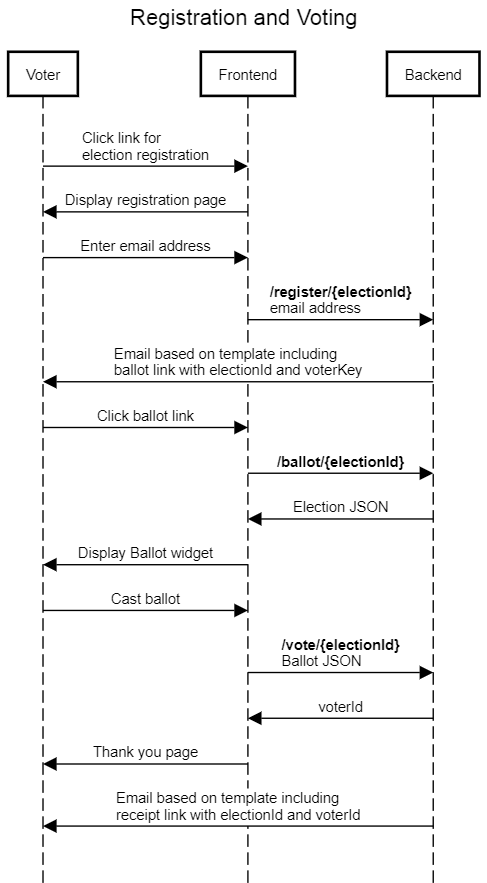

# Untitled

STAR VOTE 2.0 Architecture

All the software we create is to promote the use of [STAR Voting](https://www.starvoting.us/) by making it slick and easy for groups to use this voting method. In particular, we want to encourage the use of STAR Voting by organizations conducting their internal elections.

The current [star.vote](https://star.vote/) website, built with [Apache, PHP7, MariaDB, jQuery/Mobile](https://github.com/msmunter/star.vote) provides support for creating and running elections, but it is monolithic and lacks UI flexibility. The goal of this project is to build a modular suite of open source software built upon modern web technology that consists of three distinct layers that can be used together or independently:

* **Backend** server for storage and authentication
* **Tabulation** logic for computing election winners and related metrics
* **Frontend** website and widgets for casting ballots and viewing election results

#### Targeted Use Cases

Eventually, these layers might be combined into a more powerful and flexible version of the star.vote website, but our initial focus is on building a backend server enabling these use cases:

* **Groups wanting a custom frontend to their election using our backend**
* **Groups wanting to host their own election using their own server**
* **Developers wanting to integrate STAR Voting into their applications**

#### Design Overview

We already have a [JavaScript library for tabulation](https://github.com/Equal-Vote/star-core), which is incorporated into a [tool for displaying results of a STAR election](https://starview.netlify.app/) and a [widget for casting a STAR ballot](https://metavote.netlify.app/demo/bidenvp). Thus, our biggest need is backend storage and security for online elections.

The STAR Election Server will support the following capabilities:

* [**Voter Services**]() _- The primary functions of the system_
  * Register for an election
  * Cast a ballot
  * Retrieve election results
* [**Election Services**]() _- Enabling features to create & manage elections_
  * Create an election specifying candidates and election settings
  * Get the election details
  * Update election info prior to starting the election
  * Delete election
  * Open/close polls for casting ballots
* [**Account Services**]() _- Security features to restrict access to the system_
  * Create/edit/delete account for election services
  * Login/logout
  * Reset/change password

The server will be open source with no closed-source dependencies. It will be available as a github repository for groups or developers who wish to have complete control of their data. We will also host a version of the server for those interested in having a custom user interface without the need to host their own backend service.

##  Voter Service Scenarios

The core goal of the system is to enable voting, so here are a couple sequence diagrams illustrating how the frontend and backend interact allowing a voter to register, vote and view election results.

### 

### 

##  Backend Interface Specification

###  Voter Services Interface Specification

These services require an API Key as described in [**Authentication**]().

<table>
  <thead>
    <tr>
      <th style="text-align:left">Verb</th>
      <th style="text-align:left">Path</th>
      <th style="text-align:left">Body</th>
      <th style="text-align:left">Action</th>
      <th style="text-align:left">Returns</th>
    </tr>
  </thead>
  <tbody>
    <tr>
      <td style="text-align:left">POST</td>
      <td style="text-align:left">
        
/register

        
/{electionId}

      </td>
      <td style="text-align:left">Email addresses</td>
      <td style="text-align:left">Email addresses are passed in body as text. One email per line or comma
        separated. An email with a ballot link is sent to each based on the register.html
        template.</td>
      <td style="text-align:left">status per email</td>
    </tr>
    <tr>
      <td style="text-align:left">GET</td>
      <td style="text-align:left">/ballot
         /{electionId}</td>
      <td style="text-align:left">none</td>
      <td style="text-align:left">Returns details about the election for rendering a ballot</td>
      <td style="text-align:left">Election</td>
    </tr>
    <tr>
      <td style="text-align:left">POST</td>
      <td style="text-align:left">
        
/vote

        
/{electionId}

      </td>
      <td style="text-align:left">Ballot</td>
      <td style="text-align:left">The pollId and candidateId values in the json are validated to minimize
        the risk of a ballot being cast in the wrong election. An email receipt
        is sent to the voter based on the receipt.html template.</td>
      <td style="text-align:left">Vote index</td>
    </tr>
    <tr>
      <td style="text-align:left">GET</td>
      <td style="text-align:left">
        
/receipt

        
/{electionId}

        
/{voteId}

      </td>
      <td style="text-align:left">none</td>
      <td style="text-align:left">Returns ballot for that particular voterId.</td>
      <td style="text-align:left">Ballot</td>
    </tr>
    <tr>
      <td style="text-align:left">GET</td>
      <td style="text-align:left">
        
/results

        
/electionId

      </td>
      <td style="text-align:left">none</td>
      <td style="text-align:left">Returns the election results. For elections with an endTime, voters may
        not access results prior to that time. However, authenticated users with
        a <a href>role</a> in the election may access results at any time.</td>
      <td
      style="text-align:left">Results</td>
    </tr>
  </tbody>
</table>

export interface Ballot {

 votes: Vote\[\]; // One per poll

}

export interface Vote {

 pollId: string; // Must match the pollId of the election

 scores: Score\[\]; // One per candidate

}

export interface Score {

 candidateId: string; // Must match the candidateId of the poll

 score: number; // 0-5 integer value

}

### Election Services Interface Specification

These endpoints require an API Key and an authenticated user as described in [**Authentication**]().

<table>
  <thead>
    <tr>
      <th style="text-align:left">Verb</th>
      <th style="text-align:left">Path</th>
      <th style="text-align:left">Body</th>
      <th style="text-align:left">Action</th>
      <th style="text-align:left">Returns</th>
    </tr>
  </thead>
  <tbody>
    <tr>
      <td style="text-align:left"><b>POST</b>
      </td>
      <td style="text-align:left"><b>/election</b>
      </td>
      <td style="text-align:left">Election?</td>
      <td style="text-align:left">Election may specify desired electionId, but must be unique within account.
        Otherwise, the system generates an initial Election which can be edited
        by the user.</td>
      <td style="text-align:left">Election</td>
    </tr>
    <tr>
      <td style="text-align:left"><b>GET</b>
      </td>
      <td style="text-align:left"><b>/election /{electionId}</b>
      </td>
      <td style="text-align:left">none</td>
      <td style="text-align:left">Returns Election json.</td>
      <td style="text-align:left">Election</td>
    </tr>
    <tr>
      <td style="text-align:left"><b>PUT</b>
      </td>
      <td style="text-align:left"><b>/election /{electionId}</b>
      </td>
      <td style="text-align:left">Election</td>
      <td style="text-align:left">
        
Election updated with specified json

        
If the election has not yet been started.

      </td>
      <td style="text-align:left">status only</td>
    </tr>
    <tr>
      <td style="text-align:left"><b>DELETE</b>
      </td>
      <td style="text-align:left">
        
<b>/election</b>
        

        
<b>/{electionId}</b>
        

      </td>
      <td style="text-align:left">none</td>
      <td style="text-align:left">Deletes an election including all associated election data</td>
      <td style="text-align:left">status only</td>
    </tr>
    <tr>
      <td style="text-align:left"><b>POST</b>
      </td>
      <td style="text-align:left">
        
<b>/election</b>
        

        
<b>/{electionId}</b>
        

        
<b>/open</b>
        

      </td>
      <td style="text-align:left">opt start &amp; end times</td>
      <td style="text-align:left">Updates the election to start immediately or at the specified startTime.
        The endTime of the election is updated, if specified.</td>
      <td style="text-align:left">status only</td>
    </tr>
    <tr>
      <td style="text-align:left"><b>POST</b>
      </td>
      <td style="text-align:left">
        
<b>/election</b>
        

        
<b>/{electionId}</b>
        

        
<b>/close</b>
        

      </td>
      <td style="text-align:left">opt end time</td>
      <td style="text-align:left">Ends the election immediately or at the specified endTime. The endTime
        of the election is updated, if specified,</td>
      <td style="text-align:left">status only</td>
    </tr>
  </tbody>
</table>

export interface Election {

 electionId: string; // identifier assigned by the system

 frontendUrl: string; // base URL for the frontend

 title: string; // one-line election title

 description?: string; // mark-up text describing the election

 startUtc?: Date; // when the election starts

 endUtc?: Date; // when the election ends

 polls: Poll\[\]; // one or more poll definitions

}

export interface Poll {

 pollId: string; // short mnemonic for the poll

 title: string; // display caption for the poll

 description?: string; // mark-up text describing the poll

 candidates: Candidate\[\];

}

export interface Candidate {

 shortName: string; // short mnemonic for the candidate

 fullName: string; // full name of the candidate

 party?: string; // candidate affiliation

 candidateUrl?: string; // link to info about candidate

 partyUrl?: string; // link to info about party

 bio?: string; // mark-up text descripting the candidate

}

### Account Services Interface Specification

All **bold** services require an authenticated user as described in [**Authentication**]().

| Verb | Path | Body | Action | Returns |
| :--- | :--- | :--- | :--- | :--- |
| POST | /account | Credentials | Creates an account for the user | status only |
| POST | /login | Credentials | Verifies credentials and returns a bearer token to be included with calls to Election Services | JWT |
| POST | /reset | email | Sends an email with a new secure password to the user’s email address based on the password.html template. | status only |
| **POST** | **/newpwd** | NewPassword | Used to change password including after login. | status only |

export interface Credentials {

 userId: string;

 password: string;

}

export interface NewPassword {

 oldPassword: string;

 newPassword: string;

}

At present, the interface design does not allow for sharing administrative access to an election between users, but this future requirement is anticipated in the [Storage Design]().

## Storage Design

The storage design of the election server is very straightforward and efficient. It’s all based on text files. This keeps things simple, eliminates dependencies on complex infrastructure such as databases, and is perfectly fast and scalable for our needs: elections supporting thousands, but not millions of voters.

Here’s an overview of the file structure:

Note that all the content is stored under a single **data** folder containing these subfolders:

* **accounts**: has one subfolder per account where folder name = email address.
* **elections**: has one subfolder per election where folder name = electionId.
* **keys**: has one text file per API key where filename = key and content specifies rights.
* **templates**: has html files with macro variables that are used as templates for emails. 

###  accounts folder

Each account \(for example, **jay@equal.vote**\) contains an **elections.txt** file containing the electionId \(for example, **azxy123**\) associated with that user, one per line. All the data about each election is stored in a subfolder under the elections folder.

###  elections folder

#### accounts.txt

Each election folder \(for example, **azxy123**\) contains an **accounts.txt** file that lists the email addresses of the associated users, one per line. The system enforces bidirectional referential integrity between the **elections.txt** and **accounts.txt** files.

In the future, the **accounts.txt** files will also assign a [role]() to each account collaborating in the administration of an election. For the initial release, each election will have a single Owner and no other associated accounts.

#### status.json

This is a small JSON file maintained by the server with the following data:

{

 state: “Test” \| “Open” \| “Closed”

 startUtc: “2021-03-20 14:00”,

 endUtc: “2021-03-31 23:59”,

 votes: 0

}

When an election is first created, it’s in the Test state. In this state, votes may be cast and the election.json file may be replaced which also triggers resetting the other files. When testing is complete, the state must be changed to Open This again triggers resetting the other files, but after this point no other changes are permitted to the election.json file. While Open, votes may be cast and, optionally, the administrator may Close the election. Once the election is Closed, no more changes are allowed. The start/end times in the election.json file are ignored by the backend while the election is in Test state, though the frontend should still display those times.

#### voters.csv

This file is updated as voters register and cast ballots. It contains one row per voter with the following columns:

* **email**: Email address of the voter
* **voterkey**: voterkey assigned to the voter upon registration
* **voteTime**: UTC timestamp when the voter cast their ballot \(initially blank\)
* **voterId**: Integer uniquely identifying the voter in the CVR files.

#### 

#### election.json

To render a ballot nicely, we want some additional information about candidates and the polls which is stored in a JSON file like this:

{

 electionId: “azxy123”,  
 title: “My Sample Election”,

 frontendUrl: “https://www.myblog.com/elections/azxy123”,

 description: “This is a sample election”,

 startUtc: “2021-03-20 14:00”,

 endUtc: “2021-03-31 23:59”,

 polls: \[

 {

 pollId: “FaveCharacter”,

 title: “Favorite Breaking Bad Character”

 candidates: \[

 {

 shortName: “Skyler”,

 fullName: “Skyler White”

 party: “”,

 candidateUrl: “”,

 partyUrl: “”,

 bio: “Widow of Walter White and Mom to Walt Jr & Holly”

 },...

 \]

 }, ...

 \]

}

This JSON file defines the election and provides additional information to help with rendering ballots. The frontendUrl is a the base URL that will be used in email notifications sent by the server for voter registration and confirmation of their vote.

Each poll has a pollId which is a short mnemonic for the poll used in naming the related files. The poll title is a longer string for use by the frontend. Similarly, each candidate has both a shortName and a fullName. The shortName is used for validating votes cast and to keep columns narrow in the CSV files reporting the results for each poll. The fullName is a longer display string for use when rendering the ballot.

The remaining fields in the JSON are intended for use by the widget rendering a ballot.

#### votes\_\*.csv

Each election consists of one or more polls. Each poll has a short unique name assigned by the user and that pollId is included in the file name in place of the asterisk.

For vote tabulation, the results of each poll are represented as a simple Cast Voter Record \(CVR\) which is a Comma Separated Value \(CSV\) text file with the first line listing the candidates shortName and each subsequent line representing a single vote. The first column is reserved for an integer voter index. Thus, a simple CVR for five voters and three candidates might look like this:

Voter,Skyler,Jesse,Gus

1,0,5,4

2,1,2,5

3,1,1,1

4,0,2,0

5,5,3,0

Using this compact format, the CVR for an election with 8 candidates and 1000 voters would be about 21KB scaling up to about 50,000 votes per megabyte.

The Election Server simply returns CVRs and leaves all tabulation and result visualization to the client. Casting a vote mostly just appending a live of text to the bottom of the CVR file.  

###  keys folder

To control access to the server all requests must contain an API Key provided by the frontend as a X-Api-Key header. The server checks that a file exists in the keys folder matching the provided key. If not, the request is rejected with a 401 error.

The contents of the file are irrelevant for the initial release of the server, only the filename matters. In the future, the file contents may specify what resources may be accessed using that API key.

If the keys folder is missing or empty, no X-Api-Key header is required.

###  templates folder

This folder contains html files with the content for various emails sent by the backend:

* register.html: When a voter registers, this email provides a voterkey.
* receipt.html: When a voter casts their ballot, this email provides confirmation.
* password.html:When a user requests a password reset, this provides the user with their new password.

These emails will include placeholder tokens that are replaced with dynamic information from the election. For example, using the frontendUrl, the register email could contain a ballot link to the frontend. Details on which variables are currently TBD.

##  Authentication

Authentication occurs at multiple levels for this server:

* A website/program needs is granted access to the server with an API Key
* A user needs an account on the system to create and manage elections
* A voter needs to be credentialed to vote in an election

API Keys are intended to authorize a frontend application to access the backend server. Each organization developing a frontend to the server should be assigned a unique API Key. The API Key may in the future specify the level of access permitted \(ex, read-only vs read-write\), but for the initial release that level of granularity is not required. API Keys are not specific to an election. However, most endpoints require account authentication.

Account authentication is provided by the Account Services interface and ensures that each account may only manage elections they created.

Voter credentialing is provided by the register endpoint of the Voter Services interface. Note that a voter need not have an account on the system to vote in an election, but they must provide an email address to register and be able to access that email address to retrieve their unique voterkey.

##  Concurrency Management

Since certain server operations require access to multiple files, we need a mechanism to ensure that those file operations can be performed as an atomic transaction. This can be accomplished using a lockfile implementation such as [proper-lockfile](https://www.npmjs.com/package/proper-lockfile).

For the level of scalability we need, it should be sufficient to have one lockfile per election. This implies that the system will serialize operations on the same election. But, given that the files are small, this should still allow somewhere between 10 to 100 voters to be cast per second. And, in the case of timeouts, the server could return a [429 error](https://developer.mozilla.org/en-US/docs/Web/HTTP/Status/429) and the client could simply retry.

##  Future Enhancements

The initial design of the STAR Election Server is intended to provide a minimally viable product that is sufficient to meet the real-world needs of users in our [target use cases]().

### Roles

We want to allow multiple users to collaborate on the administration of an election. Toward that end, the following roles are anticipated:

* **Owner**
  * Each election has exactly one owner
  * Owner is a super-user for the election with full Admin rights
  * When a user creates an election, she is designated Owner.
  * API support to manage roles is anticipated as a future server enhancement but is out of scope for the initial release.
  * In the future, the Owner will have the ability to transfer ownership of the election to another account.
* **Admin**
  * Has full rights to Election Services endpoints for the election.
  *  When API support is added, only the Owner will have access to manage roles.
* **Auditor**
  * Has read-only access to election data, including viewing results while the election is in progress.

For the initial release, we go with the following simplifications:

* Only the Owner role is recognized.
* Each election is owned by the account that created it.
* There is no API support for administering roles. 

### Custom Templates

We will allow election administrators to customize the html templates used for their election. This will be done by allowing for a **templates** subfolder within any election subfolder. When a template is needed the system will first check for a custom template in that folder before looking in the system templates folder. We will also extend the Election Services API to include GET and PUT operations on the templates.

### Access to the voters.csv file

For the initial release, the voters.csv which includes the mapping from email address to voterkey to voterId is private and only accessible to system administrators via the file system. In the future, API access to the file could be added with appropriate controls to protect the privacy of voters.

### Email Whitelists

It would be useful to allow election administrators to predefine a list of email addresses that are permitted to vote in the election. This would be a text file in the election folder \(whitelist.txt\) that contains a list of email addresses, one per line. It might also support a wildcard syntax allowing all email addresses from a specified domain.

When the whitelist.txt file is defined, it will be checked on all **register** calls and the user will receive an 403 error status if their email address is not on the list.

### Email Blacklists

Some administrators might prefer to monitor the registered email addresses and make credentialing decisions after votes have been cast. Rejected email addresses would be specified in a blacklist.txt file within the election folder. Only specific email addresses may be specified in this file, no wildcards.

When the the blacklist.txt file is updated, the system will revise the votes\_\*.csv files removing the blacklisted votes, but these votes will be moved to parallel rejected\_\*.csv files so that the operation is reversible.

